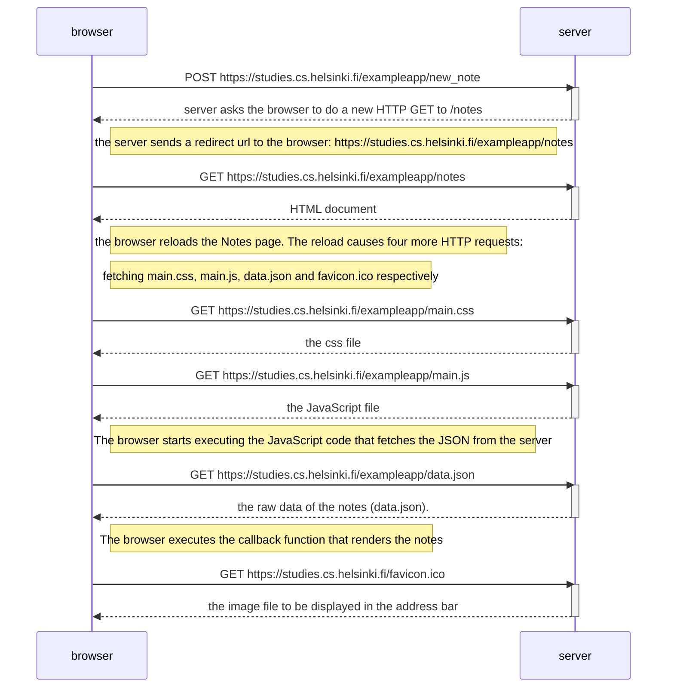

# exercise 4 solution 

``` mermaid
sequenceDiagram
    participant browser
    participant server
    
    browser->>server: POST https://studies.cs.helsinki.fi/exampleapp/new_note
    activate server
    server-->>browser: server asks the browser to do a new HTTP GET to /notes
    deactivate server
    
    Note right of browser: the server sends a redirect url to the browser: https://studies.cs.helsinki.fi/exampleapp/notes
    
    browser->>server: GET https://studies.cs.helsinki.fi/exampleapp/notes
    activate server
    server-->>browser: HTML document
    deactivate server
    
    Note right of browser: the browser reloads the Notes page. The reload causes four more HTTP requests: 
    Note right of browser: fetching main.css, main.js, data.json and favicon.ico respectively

    
    browser->>server: GET https://studies.cs.helsinki.fi/exampleapp/main.css
    activate server
    server-->>browser: the css file
    deactivate server
    
    browser->>server: GET https://studies.cs.helsinki.fi/exampleapp/main.js
    activate server
    server-->>browser: the JavaScript file
    deactivate server
    
    Note right of browser: The browser starts executing the JavaScript code that fetches the JSON from the server
    
    browser->>server: GET https://studies.cs.helsinki.fi/exampleapp/data.json
    activate server
    server-->>browser: the raw data of the notes (data.json).
    deactivate server
    
    Note right of browser: The browser executes the callback function that renders the notes 

    browser->>server: GET https://studies.cs.helsinki.fi/favicon.ico
    activate server
    server-->>browser: the image file to be displayed in the address bar
    deactivate server
    

```